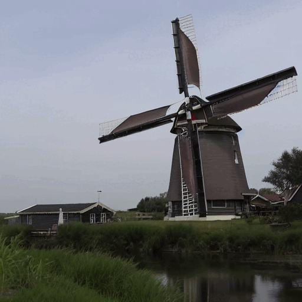
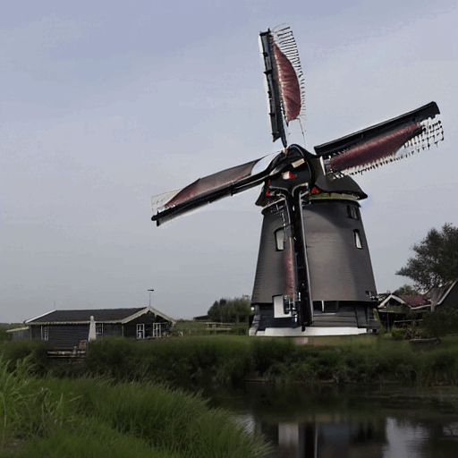

<div align="center">

<h1>Enhancing Text-to-Video Editing with Motion Map Injection</h1>


<br>

<image src="results/figure1.jpg" width='50%' height='50%' />
<br>

</div>

## Abstract
Based on the remarkable performance of text-to-image diffusion models, text-guided video editing studies recently have been expanded. Existing video editing studies have introduced an implicit method of adding cross-frame attention to estimate inter-frame attention, resulting in temporally consistent videos.
However, because these methods use models pre-trained on text-image pair data, they do not handle unique property of video: motion. When editing a video with prompts, the attention map of the prompt implying the motion of the video (e.g. `running', `moving') is prone to be poorly estimated, which causes inaccurate video editing. To address this problem, we propose the `Motion Map Injection' (MMI) module to consider motion explicitly. The MMI module provides text-to-video (T2V) models a simple but effective way to convey motion in three steps: 1) extracting motion map, 2) calculating the similarity between the motion map and the attention map of each prompt, and 3) injecting motion map into the attention maps. Given experimental results, input video can be edited accurately with MMI module. To the best of our knowledge, our study is the first method that utilizes the motion in video for text-to-video editing.


## Examples
### You can find more experimental results [on our project page](https://currycurry915.github.io/MMI/).

<table class="center">
<tr>
  <td align="center" ><b>Input Video</b></td>
  <td align="center" ><b>Video-P2P</b></td>
  <td align="center" ><b>Ours</b></td>
</tr>

 <tr>
  <td align="center" width=25% style="text-align:center;color:gray;">"clouds flowing under a skyscraper"</td>
  <td align="center" width=25% style="text-align:center;">"waves flowing under a skyscraper"</td>
  <td align="center" width=25% style="text-align:center;color:gray;">"waves flowing under a skyscraper"</td>
</tr>

<tr>
  <td align="center" style colspan="1"></td>
  <td align="center" style colspan="1"></td>
  <td align="center" style colspan="1"></td>
</tr>


<tr>
  <td align="center" width=25% style="text-align:center;color:gray;">"clouds flowing on the mountain"</td>
  <td align="center" width=25% style="text-align:center;">"lava flowing on the mountain"</td>
  <td align="center" width=25% style="text-align:center;color:gray;">"lava flowing on the mountain"</td>
</tr>

<tr>
  <td align="center" style colspan="1"></td>
  <td align="center" style colspan="1"></td>
  <td align="center" style colspan="1"></td>       
</tr>

<tr>
  <td align="center" width=25% style="text-align:center;color:gray;">"spinning wings of windmill are beside the river"</td>
  <td align="center" width=25% style="text-align:center;">"yellow spinning wings of windmill are beside the river"</td>
  <td align="center" width=25% style="text-align:center;color:gray;">"yellow spinning wings of windmill are beside the river"</td>
</tr>

<tr>
  <td align="center" style colspan="1"></td>
  <td align="center" style colspan="1"></td>
  <td align="center" style colspan="1"></td>       
</tr>
</table>


## Setup

The environment is very similar to [Video-P2P](https://github.com/ShaoTengLiu/Video-P2P).

The versions of the packages we installed are:

torch: 1.12.1 \
xformers: 0.0.15.dev0+0bad001.d20230712

In the case of xformers, I installed it through the [link](https://github.com/bryandlee/Tune-A-Video/issues/4) introduced by Video-P2P.

```shell
pip install -r requirements.txt
```


## Weights

We use the pre-trained stable diffusion model. You can download it [here](https://huggingface.co/runwayml/stable-diffusion-v1-5). 


## Quickstart

Since we developed our codes based on Video-P2P codes, you could refer to their [github](https://github.com/ShaoTengLiu/Video-P2P), if you need.

Please replace **pretrained_model_path** with the path to your stable-diffusion.

To download the pre-trained model, please refer to [diffusers](https://github.com/huggingface/diffusers).


``` bash
# Stage 1: Tuning to do model initialization.

# You can minimize the tuning epochs to speed up.
python run_tuning.py  --config="configs/cloud-1-tune.yaml"
```

``` bash
# Stage 2: Attention Control

python run_attention_flow.py --config="configs/cloud-1-p2p.yaml" --motion_prompt "Please enter motion prompt"

# If the prompt is "clouds flowing under a skyscraper", the motion prompt is "flowing".
# You can input the motion prompt as below.

python run_attention_flow.py --config="configs/cloud-1-p2p.yaml" --motion_prompt "flowing"
```

Find your results in **Video-P2P/outputs/xxx/results**.
